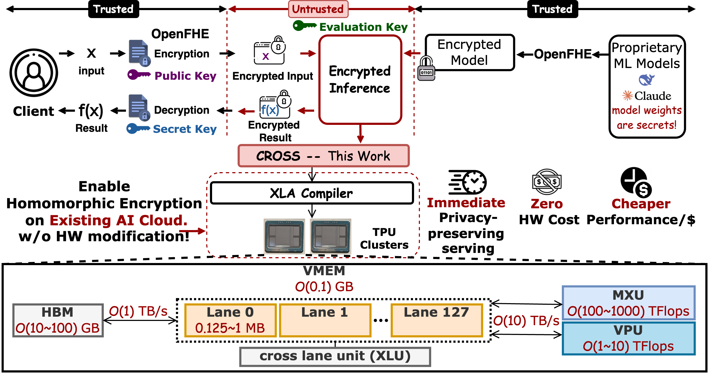
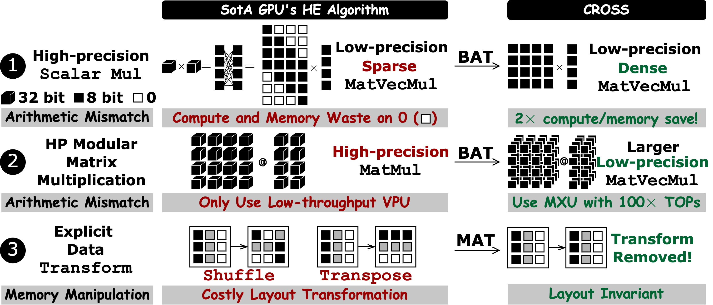

<!-- markdownlint-disable MD001 MD041 -->
<p align="center">
  
</p>


<h3 align="center">
TPU-accelerated, free, immediate, fast, and cheap HE serving for everyone
</h3>
<p align="center">
| <a href="https://arxiv.org/abs/2501.07047">paper</a> |
<a href="https://github.com/EfficientPPML/CROSS">code</a> |
<a href="https://efficientppml.github.io/CROSS_Tutorial/">tutorial</a> |
<a href="https://youtu.be/TFnQPlLZs1E">HPCA Talk</a> |
<a href="https://youtu.be/cN79ELoecNI?si=W4iwt0XoRQ0jhRo6">Microsoft Talk</a> |
<a href="https://docs.google.com/presentation/d/15WgTXtnLK3Lxjai3YHxKrbEG_WGTeQvcgBvzXs47-1s/edit?usp=sharing">slides</a> |
</p>

🔥 We have delivered a tutorial at ASPLOS'26 to help you get started with CROSS. Please visit [CPA_tutorial](https://efficientppml.github.io/CROSS_Tutorial/) to learn more.
For questions, please drop an email to our community [email](cpacommunity@googlegroups.com).

---

# CROSS: Enable AI Accelerator for Homomorphic Encryption
[](./LICENSE)

Current release: **3.0.0** (`jaxite_word.__version__`).

# What is CROSS?
CROSS is the first project to enable AI Accelerator, such as Google TPUs, to accelerate Homomorphic Encryption and achieves the State-of-the-art (SotA) throughput and energy efficiency (performance per watt) in HE operators (e.g., HE-Multiplication, HE-Rotation) and HE kernerls (e.g., Number Theory Transformation throughput) among commodity devices (CPUs, GPUs, FPGAs). The detailed flow is shown in the figure below.



The state-of-the-art performance relies on two key optimizations, including Basis Aligned Transformation (BAT) and Memory Aligned Transformation (MAT), as illustrated in figure below.



This repo contains 
- Python JAX implementation (in `jaxite_word`) to deploy Homomorphic Encryption workload on Google's TPUs. A subset of CROSS repo is integrated into Google's [jaxite](https://github.com/google/jaxite) library to enable TPU for accelerate the CKKS scheme.
- The digit detection model (using 5-layer CNN for digit detection under MNIST dataset), which won the 2nd-place at Unversity DEMO @ DAC'25. 

Notes:
- It's called jaxite_word as it adopts word-level homomorphic encryption scheme ([CKKS](https://eprint.iacr.org/2016/421.pdf)).
- TPU could be programmed by JAX, PyTorch and TensorFlow. We choose JAX to make it aligned with existing bit-level homomorphic encryption library [jaxite](https://github.com/google/jaxite). JAX itself is a hardware agnostic library which could run on CPU, GPU and TPU, such that CROSS could run on CPU and GPU as well for functional testing. For performance evaluation on GPU, we recommend implementing a customized CUDA kernel to get better performance.
- CROSS is verified against [OpenFHE](https://github.com/openfheorg/openfhe-development). And CROSS could directly take encrypted ciphertext value from OpenFHE and accelerate it on TPU.

- Artifact Evaluation: please navigate to the jaxite_word folder.

# 1. Quickstart

```bash
wget https://repo.anaconda.com/miniconda/Miniconda3-latest-Linux-x86_64.sh
chmod +x ./Miniconda3-latest-Linux-x86_64.sh
./Miniconda3-latest-Linux-x86_64.sh
# follow instructions and set up launch into .bashrc
```

```bash
conda create --name jaxite python=3.13 && conda activate jaxite
pip install -U "jax[tpu]" xprof absl-py pandas gmpy2
# The demos trace and train ordinary PyTorch models; CPU-only torch is enough.
pip install torch torchvision --index-url https://download.pytorch.org/whl/cpu
```

Every public ciphertext boundary is a rank-5 `Polynomial` whose payload is
`(batch, num_elements, r, c, num_moduli)` with `r * c == degree`; see
`jaxite_word/API_REFERENCE.md`. Fresh ciphertexts live at
`max_level = (num_q - 1) // composite_degree`; each rescale consumes one level.

## 1.1 Context-level HE operator API

`jaxite_word/he_ops.py`, `jaxite_word/he_params.py`, `jaxite_word/ptct_mul.py`,
plus extensions to `ckks_ctx.py`, `hemul.py`, `finite_field.py`, `ntt_mm.py`,
`polynomial.py`. Documented in `jaxite_word/API_REFERENCE.md`.

`CKKSContext.program_initialization(...)` is an offline step that builds a
shared `HEParameterCache` (NTT / Barrett / per-level BConv / pre-allocated
ciphertext helpers) and exposes level-indexed accessors.

```python
ctx = CKKSContext(params)
ctx.program_initialization(
    total_rotation_indices=[1, 2],
    dnum=3, r=4, c=4, batch=1)

result = ctx.he_mul[level].mul(ct1, ct2)              # ct × ct (rescale + relin)
ct3   = ctx.he_mul[level].hemul_no_relin(ct1, ct2)    # 3-element output
ct2   = ctx.he_mul[level].relinearize(ct3)            # back to 2-element
rot   = ctx.he_rot[level, k].rotate(ct)
ct_out = ctx.ptct_mul[level].mul(ct_in, pt)           # plaintext × ciphertext
ct_lo = ctx.he_rescale[src, dst].rescale(ct)
```

This direct route requires the caller to know the complete rotation set up
front; `Mapping` computes it for a packed program. The level-indexed accessors
return private operator objects (`_HEMulAtLevel`, `_HERotAtLevel`,
`_HERescaleAtLevels`, `_HEPtCtMulAtLevel`, `_BSGSMatVecAtLevel`) that share
the context's NTT and Barrett tables.

Tests: `ckks_ctx_test.py`, `hemul_test.py`, `herot_test.py`, `ptct_mul_test.py`.


# 2. TPU Setup
- Step 1: Create a Google Project [tutorial](https://cloud.google.com/appengine/docs/standard/nodejs/building-app/creating-project).

Obtain the name of the project as <google_project_name> and **Google Project ID** from the created project.

- Step 2: Apply for the Tree-tier TPU trail for 30 days[TRC](https://sites.research.google/trc/about/)

Once submitted the request, an email will be shot to you within one day, where there is a link to fill in a survey with your **Google project ID**.

- Step 3: Launch TPU VM.
You could do it over GUI or gcloud cli (in your local machine) to create a TPU VM. I give the gcloud cli as it works for all generations (>=v4) of TPUs.

For TPUv4,
```bash
gcloud config set project <google_project_name>
gcloud config set compute/zone us-central2-b
gcloud alpha compute tpus queued-resources create <google_project_name> --node-id=<your_favoriate_node_name> \
    --zone=us-central2-b \
    --accelerator-type=v4-8  \
    --runtime-version=v2-alpha-tpuv4 \
```

For TPUv5e,
```bash
gcloud config set project <google_project_name>
gcloud config set compute/zone us-central1-a
gcloud alpha compute tpus queued-resources create <google_project_name> --node-id=<your_favoriate_node_name> \
    --zone=us-central1-a \
    --accelerator-type=v5litepod-4  \
    --runtime-version=v2-alpha-tpuv5-lite \
    --provisioning-model=spot
```

For TPUv6e,
```bash
gcloud config set project <google_project_name>
gcloud config set compute/zone us-east1-d
gcloud alpha compute tpus queued-resources create <google_project_name> --node-id=<your_favoriate_node_name> \
    --zone=us-east1-d \
    --accelerator-type=v6e-1  \
    --runtime-version=v2-alpha-tpuv6e \
    --provisioning-model=spot
```

Note that TPUv5e and TPUv6e could only work with provisioning-model as spot, because they are popular resources, and Google cloud can preempt it if there are tasks with higher priority requiring these resources. But you could get a long-term active TPUv4 VM as it's less demanding by other tasks.

- Step 4: Setup Remote SSH (VSCode or Cursor) to TPU VM
Once the requested TPU vm is up and running as shown in Google console, you could use gcloud to forward the SSH port of the remote machine to a port of local machine and setup VSCode remote ssh.

You need to first setup local ssh key to Google's compute engine, following [link](https://cloud.google.com/compute/docs/connect/create-ssh-keys#gcloud). After your follow the instructions on the page, the ssh key will be dumped here `<path_to_local_user>/.ssh/google_compute_engine`.


```bash
gcloud compute tpus tpu-vm ssh <gcloud_user_name>@<your_favoriate_node_name> -- -L 9009:localhost:22
```
Where 9009 is the port of local machine, while 22 is the SSH port of the TPU vm.

After you set it up, you could configure VSCode to use the remote SSH package [link](https://code.visualstudio.com/docs/remote/ssh) to remotely access into TPUvm.
```bash
Host tpu-vm
    User <gcloud_user_name>
    HostName localhost
    Port 9009
    IdentityFile  <path_to_local_user>/.ssh/google_compute_engine
```

After this, you should follow the steps on [link](https://code.visualstudio.com/docs/remote/ssh) to log into TPU VM.

# Environment Setup
Inside TPU VM, please do following setup to configure the environment.

- Step 1: install miniconda
```
wget https://repo.anaconda.com/miniconda/Miniconda3-latest-Linux-x86_64.sh
chmod +x ./Miniconda3-latest-Linux-x86_64.sh
./Miniconda3-latest-Linux-x86_64.sh
# follow instructions and set up launch into .bashrc
```
- Step 2: create environment and install required packages
```
source ~/.bashrc
conda create --name jaxite python=3.13
conda activate jaxite
pip install -U "jax[tpu]"
pip install xprof
pip install absl-py
pip install pandas
pip install gmpy2
# demos only (model tracing and training); CPU-only torch is enough
pip install torch torchvision --index-url https://download.pytorch.org/whl/cpu
```

# 3. Ready to run?
We offer both functional testing and performance testing scripts. 

## 3.1 Data Representation

CROSS library is designed to execute the data encoded by [OpenFHE](https://github.com/openfheorg/openfhe-development). 

In OpenFHE, a ciphertext consists of multiple high-precision polynomials, each termed as one **Element**. Each **Element** is always represented in its RNS form, i.e. a list of low-precision polynomials termed as **tower** (we call it **limb** in CROSS). All such these **limbs**s of the same ciphertext share the same **degree**. Therefore, each ciphertext is represented as 3 dimensional jax.array, with (number of elements, number of towers, degree) in CROSS.

### Cache naming and lifetime

CROSS uses caches for reusable parameter-derived tables, contexts, and
formatted key data. Module-level memoization caches follow one template:

| Purpose | Naming template |
|---|---|
| Mutable module cache | `_<subject>_cache` |
| Enable control | `_<subject>_cache_enabled` |
| Maximum entry count | `_<subject>_cache_capacity` |
| Cache record class | `<Subject>Cache` |
| Lookup helper | `_get_<subject>_cache` |
| Environment control | `CROSS_<SUBJECT>_CACHE_ENABLED` or `CROSS_<SUBJECT>_CACHE_CAPACITY` |

Uppercase Python names are reserved for immutable constants such as serialized
cache paths and format versions. Mutable dictionaries use lowercase private
names. A `pool` is a collection of candidate resources, not another name for a
cache, and new code should not use `memo` as an alternative cache suffix.
Context-owned domain collections may retain domain-specific names.

The runtime caches currently have these scopes:

| Cache | Contents | Lifetime and bound |
|---|---|---|
| `CKKSContext._param_cache` (`HEParameterCache`) | Finite-field, NTT, BConv, level, and formatted-key parameters | Owned by one `CKKSContext` |
| `util.py` utility caches (`_root_of_unity_cache`, `_bit_reverse_permutation_cache`, `_numpy_ntt_table_cache`) | Roots of unity, bit-reversal permutations, and NumPy NTT tables | Process-local; unbounded across distinct parameter tuples |
| `ntt_mm.py::_barrett_ntt_context_cache` | Complete Barrett NTT contexts | Process-local LRU; capacity 8 by default |
| `ntt_mm.py::_ntt_twiddle_cache` | Backend-neutral NTT/iNTT tables keyed by `(direction, r, c, modulus)` | Process-local; unbounded |
| `ckks_ctx.py` codec caches (`_lite_encode_context_cache`, `_encrypt_cache`, `_decrypt_cache`) | Encode, encrypt, and decrypt precomputation keyed by context identity or tower set | Process-local; unbounded |

Set `CROSS_BARRETT_NTT_CONTEXT_CACHE_ENABLED=0` to bypass the Barrett context
cache, or set `CROSS_BARRETT_NTT_CONTEXT_CACHE_CAPACITY` to a positive maximum
entry count. These settings are read when `ntt_mm.py` is imported.

Underscore-prefixed caches are private implementation details. They are not
lock-protected APIs, may retain derived tables or key references until process
exit, and must not be mutated or serialized by callers. They are separate from
the JAX/XLA compilation cache.


## 3.2 Functional Testing
```
cd CROSS/jaxite_word
python3 <item>_test.py
```
where `<item>` could take following keys to launch corresponding tests.
- `ntt_sm`: Number Theoretic Transform for a single limb (tower, meaning the polynomial with a single modulus).
- `ntt_mm`: Number Theoretic Transform for multiple limbs (each limb with one unique modulus).
- `hemul`: homomorphic multiplication, including relinearization.
- `rescale`: homomorphic rescaling.
- `herot`: homomorphic rotation (automorphism plus key switching).
- `bconv`: basis conversion, including the proposed Basis Aligned Transformation (BAT).
- `ckks_ctx`: encoding, encryption, decoding, decryption and end-to-end multiplication, rotation and rescaling.
- `headd`: homomorphic addition.
- `hesub`: homomorphic subtraction.
- `ptct_mul`: plaintext-ciphertext multiplication.
- `bsgs`: baby-step-giant-step encrypted matrix-vector multiplication.
- `bootstrapping`: CKKS bootstrapping (N=256 gates by default; larger rings are opt-in, see below).
- `key_gen`, `polynomial`, `rns`, `finite_field`, `util`: key generation, the ciphertext container, RNS arithmetic, modular reduction backends and shared utilities.
- `nn`, `packing`, `mapping_compile`: the vectorize, pack and Mapping phases of the deployment path.
- `pedagagy/ntt` and `pedagagy/bat`: the teaching implementations of NTT and BAT.

For each kernel, we offer `<item>_test.py` for functional correctness testing, and `<item>_perf_test.py` for performance testing.
`nn_test.py` and `mapping_compile_test.py` import the package as `jaxite_word` and put the repository root on `sys.path` themselves; every other file uses the flat sibling imports.

In each functional correctness testing, the provided value come from the OpenFHE as CROSS implements the algorithm used in OpenFHE.


## 3.3 Algorithm Explanation
HE kernels (NTT, Basis Conversion, scalar multiplication) have various different algorithms and implementations. Understanding the difference among them would be of critical help for proposing new ideas. 

We offer
- various implementations algorithms of NTT in the `jaxite_word/pedagagy/ntt.py` with its corresponding functional correctness testing sitting in the `jaxite_word/pedagagy/ntt_test.py`.
- the SoTA GPU library implementation of 32-bit integer modular multiplication and our proposed Basis Aligned Transformation (BAT) optimized 32-bit integer multiplication in the `jaxite_word/pedagagy/bat.py` with its corresponding functional correctness testing in the `jaxite_word/pedagagy/bat_test.py`.
- the SoTA GPU library implementation of basis conversion and our BAT-optimized version in the `jaxite_word/bconv.py` with its corresponding functional correctness testing in the `jaxite_word/bconv_test.py`.

### CKKS bootstrapping invariants

CROSS represents a logical 60-bit CKKS scale as two approximately 30-bit RNS
primes; it does not use a native 60-bit modulus. Every native modulus must
remain below `2^31` for the 32-bit Montgomery backend. For the production
Q58/P21, `dnum=3` chain, BAT basis conversion satisfies its accumulator and
Montgomery-reduction bounds while dense one-shot conversion does not. The
implementation therefore validates BAT and dense paths independently and uses
BAT normally; chunked dense conversion is only a diagnostic fallback.

Ciphertexts stay in the selected backend's computation representation during
evaluation. Encryption, ModRaise, plaintext/evaluation-key setup, and
decryption perform explicit, exactly-once representation conversions;
Montgomery REDC is not a canonicalization operation. Serialized evaluator
caches are backend-specific and must be regenerated after changing backends.

The OpenFHE-matched bootstrap shares the hoisted `c1` decomposition, retains
baby-step products and outer-group sums in QP, and applies `ApproxModDown` only
at the algorithm's group boundaries and after final accumulation. Approximate
ModDown is not additive, so per-diagonal down-conversion or merging distinct
cyclic-wrap groups changes rounding error and precision. Parity also depends
on signed unreduced ModRaise interpolation, exact q44/p15 and q58/p19 HYBRID P
bases, recursive per-level plaintext scales, independent unbiased
evaluation-key sampling, complex diagonal encoding, and the matched
normalization, rescaling, and Chebyshev-depth schedule. Preserve the
ciphertext's tracked scale through C2S, ApproxModDown, S2C, and final
correction; do not reset it to a nominal per-level scale.

Barrett and Montgomery/BAT produce bit-canonical bootstrap parity at N=256,
N=4096, and N=8192. With the matched `scalingMod=56` configuration, full-packed
CROSS results recover plaintexts and meet the OpenFHE-relative two-bit gate
through N=32768. N=65536 meets that relative comparison but fails plaintext
recovery and is not a usable result. Fixed-ring comparisons validate
arithmetic, not production security; review the final modulus chain before
deployment.

For constrained large-ring runs, `BOOTSTRAP_LOW_MEM=1` evicts operator caches
at stage boundaries and trades recomputation for bounded cache growth.
`CROSS_LAZY_TOPLEVEL_ROTKEYS=1` preserves the matched key partitioning while
materializing keys lazily; `CROSS_SKIP_TOPLEVEL_ROTKEYS=1` changes partition
boundaries and is diagnostic only. Use
`jaxite_word/bootstrapping_openfhe_crosscheck.py` for live matched-parameter
cross-validation.

## 3.4 Performance Debugging

This section provides the step-by-step guidance on how to project latency from jax.profiler back to each line of your actual JAX program for the purpose of profiling and performance debugging.

Specifically, to profile the value of the given kernel, you should use `KernelWrapper` and `Profiler` defined in `jaxite_word/profiler.py`.

1.  **Define `KernelWrapper`**: This wrapper prepares the function for profiling, handling JIT compilation and input shapes.
    ```python
    from jaxite_word.profiler import KernelWrapper, Profiler
    import jax.numpy as jnp

    # Example kernel
    def my_kernel(lhs, rhs):
        return lhs + rhs

    # Create wrapper
    wrapper = KernelWrapper(
        kernel_name="add_test",
        function_to_wrap=my_kernel,
        input_structs=[((128,), jnp.float32), ((128,), jnp.float32)]
    )
    ```

2.  **Setup `Profiler`**: Initialize the profiler, add the wrapper, and run the profiling.
    ```python
    # Initialize Profiler
    profiler = Profiler(output_trace_path="./log", profile_naming="experiment_1")

    # Add profile
    profiler.add_profile("test_case_1", wrapper)

    # Execute profiling
    profiler.profile_all_profilers()

    # Process and save results
    profiler.post_process_all_profilers()
    ```

3.  **Find the Result**: The results will be stored in the directory specified by `output_trace_path` joined with `profile_naming`.
    - A summary CSV files (e.g., `experiment_1_results.csv`) containing kernel durations.
    - Detailed JSON traces in subdirectories (e.g., `test_case_1/trace_events.json`). 


4.  **Analyze the Result**: Once each performance test finish, u will see a new `log` folder in the `<path_to_jaxite_word>` which contains the `<timestamp>.trace.json.gz` captured performance log via jax.profiler. Such log should be visualized via `xprof` [link](https://docs.jax.dev/en/latest/profiling.html#xprof-tensorboard-profiling), where `<timestamp>` is the timestamp of the profiling. 
```bash
xprof --logdir <path_to_jaxite_word>/log/xprof -p <port_id>
```
For example, `xprof --logdir ./log/xprof -p  9090`

Note that 9090 could be changed into any port that u prefer. Once it's completed, u could open the browser with `http://localhost:9090/`.

5.  **Latency Breakdown of the Run**: To automatically obtain the trace of interest from the `<timestamp>.trace.json.gz`, our profiler automatically read from the `<timestamp>.trace.json.gz`, and then convert it into `trace_events.json` and then filter kernel of interest into `filtered_events.json`. We further propose a script to analyze the latency breakdown for the `filtered_events.json`.
```bash
python3 <path_to_cross>/profile_analysis/analyze_trace_json.py <profiling_folder>/filtered_events.json
```

## 4 Artifact Evaluation
For reproducing our results in the HPCA'26 paper, please navigate into the jaxite_word folder, and run following command to obtain the results for each individual table or figure.
```bash
python3 <script>.py
```
where `<script>` could take from `tabV`, `tabVI`, `tabVII`, `tabIX`; the operator
suite of Table VIII is a shell script, run with `source tabVIII.sh`.


# Call for Actions
Our mission is to build an open-sourced SoTA library for the community.
- If you find this repository helpful, please consider giving it a star :)
- For any questions, please feel free to open an issue.
- For any suggestions or new features, please feel free to open a pull request.

# Contact
- Jianming Tong, Georgia Institute of Technology, jianming.tong@gatech.edu
- Jingtian Dang, Georgia Institute of Technology, dangjingtian@gatech.edu
- Tushar Krishna, Georgia Institute of Technology, tushar@ece.gatech.edu


# Citation

```
@inproceedings{tong2025CROSS,
author = {Jianming Tong and Tianhao Huang and Jingtian Dang and Leo de Castro and Anirudh Itagi and Anupam
Golder and Asra Ali and Jevin Jiang and Jeremy Kun and Arvind and G. Edward Suh and Tushar Krishna},
title = {Leveraging ASIC AI Chips for Homomorphic Encryption},
year = {2026},
publisher = {2026 IEEE International Symposium on High Performance Computer Architecture (HPCA)},
address = {Australia},
keywords = {AI ASICs, TPU, Fully Homomorphic Encryption},
location = {Australia},
series = {HPCA'26} }
```

Enjoy! :D
